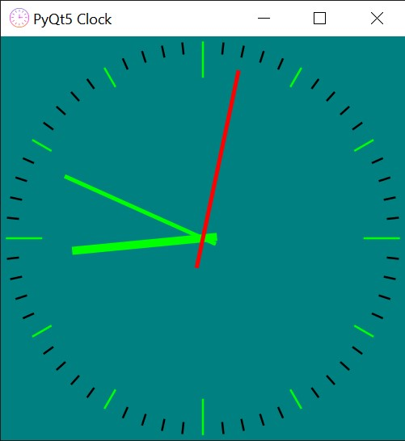

# PyQt5 Analog Clock

A minimal Clock app made with PyQt5

<div><br><br><br></div>

## Setup and Running the Program

To install the package and all dependencies:

```
git clone https://github.com/mehulsinha73/pyqt5_clock.git
conda create -n clock requirements.txt
conda activate clock
python clock.py
```
